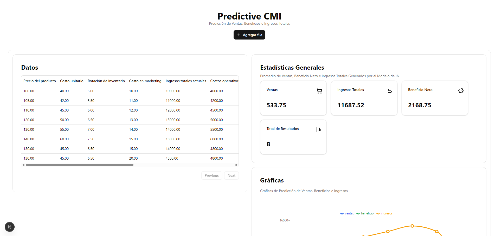
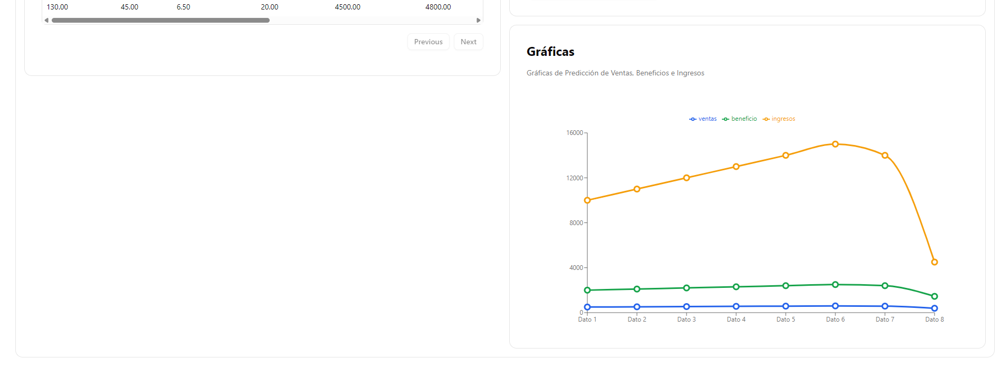

# 📊 Predictive CMI


---

## 🧠 ¿De qué trata este proyecto?

Este es un proyecto demostrativo para la **predicción de KPIs financieros** en una empresa simulada, utilizando un modelo de **regresión múltiple**. La aplicación permite al usuario ingresar datos relevantes como costos, precios, gastos operativos, demanda del sector, entre otros, y obtener una predicción de métricas clave como:

- **Ventas**
- **Beneficio Neto**
- **Ingresos Totales Finales**

> ⚠️ **Este proyecto es una demo académica**. No está optimizado para producción, y fue creado con fines didácticos y de práctica.

---

## 💻 Tecnologías utilizadas

### 🧩 Frontend

- **Next.js 14** – Aplicación cliente con `App Router` y soporte para Server Actions.
- **React 18** – Composición de componentes reutilizables.
- **Tailwind CSS** – Estilizado moderno, responsivo y rápido.
- **TypeScript** – Tipado estricto para mayor seguridad y mantenimiento.
- **shadcn/ui** – Librería de componentes UI moderna basada en Radix UI.
- **Lucide Icons** – Íconos SVG hermosos y personalizables.

### ⚙️ Backend

- **FastAPI** – Framework ligero y rápido para construir APIs en Python.
- **scikit-learn** – Para entrenar y servir un modelo de regresión múltiple.
- **Uvicorn** – ASGI server para correr la API.

---

## 🚀 Funcionalidades actuales

✅ Formulario para ingresar datos económicos  
✅ Modal interactivo con shadcn/ui  
✅ Predicción en tiempo real mediante llamada al backend  
✅ Cálculo de KPIs utilizando modelo de regresión  
✅ Tabla con resultados históricos (opcional)

---

## 📸 Capturas de pantalla

> 
> 

---

## 🛠 Instalación rápida (modo desarrollo)

### Frontend

```bash
cd frontend
pnpm install
pnpm dev
```

### Backend

```
cd backend
pip install -r requirements.txt
uvicorn main:app --reload
```

## 👨‍🎓 Créditos

Este proyecto fue creado por Yoannis Sánchez Soto (Yoss) y Yisel Pupo Batista como parte de un ejercicio académico.
